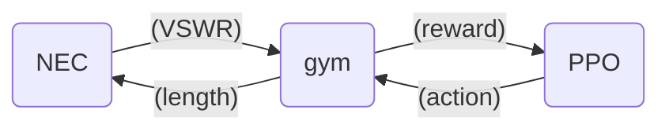

# Reinforcement Learning-Based Resonant Frequency Tuning for Wire Dipoles using NEC2
A lightweight RL environment wrapper around NEC2 for automated dipole antenna resonant frequency optimization.

Using PPO (via Stable-Baselines3) to learn the optimal length of a center-fed half-wave dipole antenna, with NEC (PyNEC) as the electromagnetic simulator providing ground-truth impedance and VSWR at each step.

## Why RL for this?

The textbook answer for a half-wave dipole length is well known,  L $\approx$ 0.48 $\times$ $\lambda$, and a simple bisection or grid search over length would converge to a low-VSWR design just fine for this single-parameter case.

I used this as a deliberately small, well-understood problem to build and debug an RL loop against a real EM solver (NEC2) rather than an analytic reward function. The end goal is to extend this to antenna geometries where there isn't a closed-form target (multi-element arrays, loaded elements, non-uniform wire radius) where a search over evaluations against a real solver is closer to what tools like this would actually be useful for. Starting with a dipole, where I can sanity check the RL result against 0.48 $\lambda$, was mainly a way to validate that the following pipeline was correct before moving on a problem without a known-good answer.



## Environment (dipole_env.py)
* Observation: [dipole_length_m, current_vswr]
* Action: continuous length adjustment, $\Delta$ length $\epsilon$ [-0.005, 0.005] m per step (100 MHz) or [-0.001, 0.001] m per step (2.4 GHz). The smaller step size at 2.4 GHz is needed because the resonant length is ~24× smaller, a 5 mm step would overshoot the entire tuning range.
* Reward: `-log(VSWR)`: a log reward gives a much smoother gradient than raw `-VSWR`, which spikes hard for detuned lengths and made early training runs unstable.
* Termination: episode ends when `VSWR < 1.05`, or after 150 steps
* Simulator: each step runs a full NEC2 simulation (PyNEC) on a 21-segment wire model at 100 MHz, center-fed, over free space `gn_card(-1, 0, 0, 0, 0, 0, 0, 0)`

The environment is parameterized by target_freq_mhz, length_min, length_max, and the action-space bounds.

## Training (train_dipole.py)
* PPO, MlpPolicy, n_steps=256, batch_size=64
* Wrapped in VecNormalize (norm_obs=True, norm_reward=True), observation scale (length of 1 m vs. VSWR of 1–1000) is wildly mismatched otherwise, and the policy effectively ignored length as a signal without this.
* Normalization stats saved to `vecnormalize.pkl` (100 MHz) or `vecnormalize_2_4_ghz.pkl` (2.4 GHz) and reloaded in an eval environment (training=False), separate from the training environment.

## 100 MHz Results

At 100 MHz, the theoretical half-wave length is:

$\lambda$ = 300 / f_MHz = 3.0 m

L = 0.48 × $\lambda$ = 1.44 m

The trained agent converges to a length **L = 1.4338 m** with VSWR= 1.4305 at 100.0 MHz. This is 0.4306% deviation from the theoretical value. 

This falls short of the environment's intentionally strict termination threshold (VSWR < 1.05) within the fixed episode, but confirms the RL policy is learning to navigate towards true physical resonance rather than a local minimum.

### Training & Convergence

**Training reward over time:**


Mean episode reward (`rollout/ep_rew_mean`) over 150,000 training timesteps. Reward drops sharply in the first ~2,000 steps as the randomly-initialized policy explores, then climbs steadily and plateaus around -120 by ~50,000
timesteps, indicating stable convergence rather than continued instability.

**Agent trajectory (single evaluation episode):**


Length and VSWR at each step of a deterministic evaluation episode, starting from a random initial length near 0.98 m. The agent moves length steadily toward the theoretical resonant length (dashed red line), with VSWR dropping from ~100 to near the termination threshold (dashed green line) within the first ~90 steps, then holding in a tight band around resonance for the remainder of the episode.

## 2.4 GHz Results
At 2.4 GHz, the theoretical half-wave length is:

$\lambda$ = 300 / f_MHz = 0.125 m

L = 0.48 × $\lambda$ = 0.0600 m

The trained agent converges to a length **L = 0.0592 m** with VSWR= 1.4447 at 2.4 GHz. This is 1.33% deviation from the theoretical value. 

This falls short of the environment's intentionally strict termination threshold (VSWR < 1.05) within the fixed episode, but confirms the RL policy is learning to navigate towards true physical resonance rather than a local minimum.

### Training & Convergence (2.4 GHz)
**Training reward over time:**

Mean episode reward (rollout/ep_rew_mean) over 300,000 training timesteps. Reward drops sharply in the first ~5,000 steps as the randomly-initialized policy explores, then climbs steadily and plateaus around -80 by ~30,000 timesteps, indicating stable convergence rather than continued instability.

**Agent trajectory (single evaluation episode):**

Length and VSWR at each step of a deterministic evaluation episode, starting from a random initial length near 0.079 m. The agent moves length steadily toward the theoretical resonant length (dashed red line), with VSWR dropping from ~14 to near the termination threshold (dashed green line) within the first ~20 steps, then holding in a tight band around resonance for the remainder of the episode.

## Ablation Study (2.4 GHz)

To understand which design choices matter at 2.4 GHz, controlled ablations was ran across five axes: reward function, observation space, action space, normalization, and algorithm. Each variant was trained with **5 random seeds**; values are mean $\pm$ standard deviation across seeds, evaluated over 20 deterministic episodes per seed.

### Reward Function

| Variant | Formula | Mean Error (%) | Mean VSWR |
|---|---|---|---|
| raw_vswr | -VSWR | 6.73 $\pm$ 2.67 | 3.00 $\pm$ 0.93 |
| log_vswr | -log(VSWR) | 7.33 $\pm$ 3.34 | 3.68 $\pm$ 1.53 |
| distance_ideal | -abs(L - 0.06) | 17.48 $\pm$ 3.34 | 27.84 $\pm$ 12.23 |
| exponential | -exp(VSWR) | 32.15 $\pm$ 14.71 | 107.71 $\pm$ 71.60 |

`raw_vswr` and `log_vswr` perform best, within a standard deviation of each other. The log transform was originally introduced to smooth early-training gradients, but the raw VSWR penalty works almost as well for this single-parameter problem. Distance-based and exponential rewards fail because they either ignore the EM simulator's true signal or explode numerically for detuned lengths, exponential's mean training return reaches roughly $-1.2\times10^{10}$, and its 14.71 point standard deviation (vs. 2.67-3.34 for the other three) shows it is not just worse on average but far less consistent across seeds.


Learning curves: 


### Observation Space

| Variant | Observation | Mean Error (%) | Mean VSWR |
|---|---|---|---|
| length_vswr | [length, VSWR] | 8.12 $\pm$ 4.08 | 4.15 $\pm$ 2.22 |
| length_only | [length] | 14.02 $\pm$ 18.10 | 34.29 $\pm$ 63.36 |
| vswr_only | [VSWR] | 23.41 $\pm$ 13.52 | 69.11 $\pm$ 77.11 |
| with_step | [length, VSWR, step_count] | 11.93 $\pm$ 8.49 | 5.42 $\pm$ 3.72 |
| with_gradient | [length, VSWR, d(VSWR)/dL] | 13.97 $\pm$ 8.87 | 28.32 $\pm$ 47.19 |

`length_vswr` (the default) is the clear winner, and also has the tightest spread across seeds. VSWR alone is insufficient because the policy cannot distinguish whether it is above or below resonance without length context, `length_only` and `vswr_only` both carry very high seed-to-seed variance ($\pm$18.10 and $\pm$13.52), suggesting these observation spaces are not just worse on average but unreliable run-to-run. Adding step count or a numerical gradient estimate does not help and adds noise.


Learning curves: 


`length_vswr` (green) and `with_gradient` (purple) climb fastest early on, but `with_gradient`'s higher-noise observation costs it accuracy by the end (13.97% final error vs. `length_vswr`'s 8.12%)m a faster-rising curve doesn't translate to a better final policy here. `vswr_only` (blue) lags significantly, confirming that length is a necessary signal for directional tuning.

### Normalization

| Variant | Mean Error (%) | Mean VSWR |
|---|---|---|
| vecnormalize_full | 5.25 $\pm$ 0.87 | 1.90 $\pm$ 0.24 |
| vecnormalize_obs_only | 7.10 $\pm$ 3.38 | 3.60 $\pm$ 1.67 |
| vecnormalize_reward_only | 16.47 $\pm$ 4.42 | 12.78 $\pm$ 2.47 |
| none | 23.32 $\pm$ 6.53 | 83.81 $\pm$ 75.81 |

Full VecNormalize is critical with 4.4 times lower error than no normalization, and a tighter spread ($\pm$0.87 vs. $\pm$6.53). Without observation normalization, the policy ignores length (scale ~0.06 m) relative to VSWR (scale ~1-14). Reward normalization alone actually is worse relative to observation normalization alone (16.47% vs. 7.10%), likely because it rescales the already well-behaved `-log(VSWR)` into a range that destabilizes the value function.


Learning curves: 


The ablations confirm that the original 2.4 GHz design ([length, VSWR] observation, `-log(VSWR)` reward, continuous $\pm$1 mm steps, full VecNormalize, PPO) is well-justified.

## Setup
```bash
pip install -r requirements.txt
# 2.4 GHz model
python train_dipole.py
```