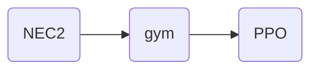

# Reinforcement Learning-Based Resonant Frequency Tuning for Wire Dipoles using NEC2
A lightweight RL environment wrapper around NEC2 for automated dipole antenna resonant frequency optimization.

Using PPO (via Stable-Baselines3) to learn the optimal length of a center-fed half-wave dipole antenna, with NEC (PyNEC) as the electromagnetic simulator providing ground-truth impedance and VSWR at each step.

## Why RL for this?

The textbook answer for a half-wave dipole length is well known,  L $\approx$ 0.48 × $\lambda$, and a simple bisection or grid search over length would converge to a low-VSWR design just fine for this single-parameter case.

I used this as a deliberately small, well-understood problem to build and debug an RL loop against a real EM solver (NEC2) rather than an analytic reward function. The end goal is to extend this to antenna geometries where there isn't a closed-form target (multi-element arrays, loaded elements, non-uniform wire radius) where a search over evaluations against a real solver is closer to what tools like this would actually be useful for. Starting with a dipole, where I can sanity check the RL result against 0.48λ, was mainly a way to validate that the NEC2 <---> gym <---> PPO pipeline was correct before moving on a problem without a known-good answer.



## Environment (dipole_env.py)
* Observation: [dipole_length_m, current_vswr]
* Action: continuous length adjustment, $\Delta$ length $\epsilon$ [-0.01, 0.01] m per step
* Reward: `-log(VSWR)`: a log reward gives a much smoother gradient than raw `-VSWR`, which spikes hard for detuned lengths and made early training runs unstable.
* Termination: episode ends when `VSWR < 1.05`, or after 25 steps
* Simulator: each step runs a full NEC2 simulation (PyNEC) on a 21-segment wire model at 100 MHz, center-fed, over free space `gn_card(-1, 0, 0, 0, 0, 0, 0, 0)`

## Training (train_dipole.py)
* PPO, MlpPolicy, n_steps=256, batch_size=64
* Wrapped in VecNormalize (norm_obs=True, norm_reward=True), observation scale (length of 1 m vs. VSWR of 1–1000) is wildly mismatched otherwise, and the policy effectively ignored length as a signal without this.
* Normalization stats saved to `vecnormalize.pkl` and reloaded in an (training=False) eval environment, separate from the training environment.

## Results

At 100 MHz, the theoretical half-wave length is:

$\lambda$ = 300 / f_MHz = 3.0 m

L = 0.48 × $\lambda$ = 1.44 m

1.4303

The trained agent converges to a length within [X]% of this and achieves VSWR $\approx$ [X.XX] over free space.

## Setup
```bash
pip install -r requirements.txt
python train_dipole.py
```