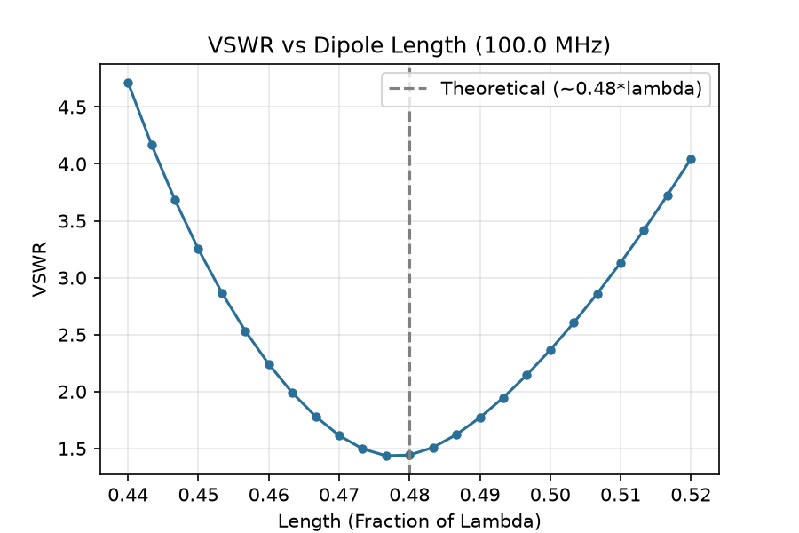
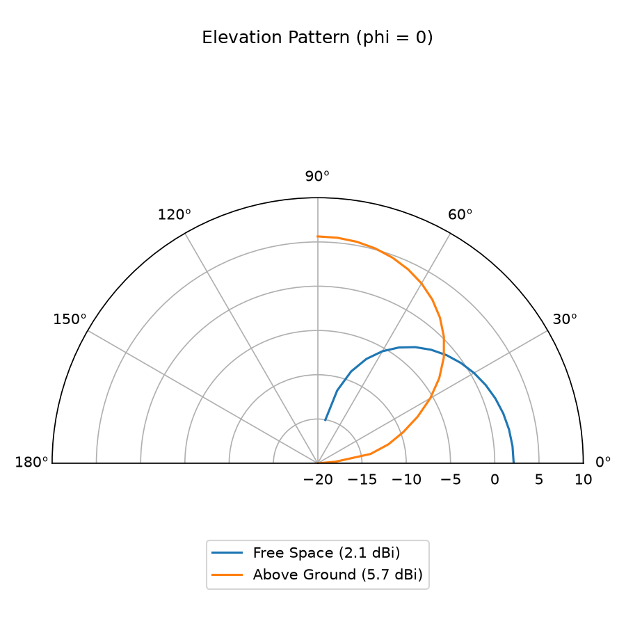
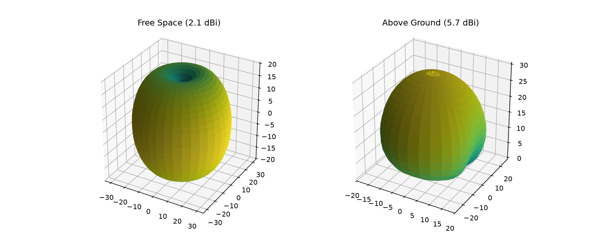

# Sanity Check for NEC2

Before building any RL agent on top of a NEC2 simulation, this code validates that the simulator itself is set up correctly, by checking its output against known theoretical antenna behavior. If the simulator can't reproduce textbook results for a simple dipole, nothing built on top of it can be trusted.

## Files

- **`testing_nec.py`**: core simulation module. Defines `simulate_dipole()`, which builds a center-fed dipole in NEC2 and returns:
  - Input impedance and VSWR at a target frequency
  - Peak gain (dBi) and the direction it occurs in
  - Full radiation pattern arrays (gain vs. theta/phi), for plotting

  Supports two modes:
  - **Free space**: dipole in a vacuum, no ground interaction
  - **Above real ground**: horizontal dipole at a given height above lossy earth ($\epsilon r$ = 13, $\sigma$ = 0.005 S/m, standard "average ground" constants), using NEC2's Sommerfeld/Norton ground model

- **`plot_result_test.py`**: generates the two validation plots below by sweeping `testing_nec.py`'s simulation function.

- **`vswr_sweep.png`**: VSWR vs. dipole length, swept from 0.44λ to 0.52λ.

- **`radiation_pattern_comparison.png`**: elevation-plane ($\phi$ = 0°) radiation pattern, free space vs. above ground, overlaid.

## Observation

### 1. Resonant length (VSWR sweep)

A half-wave dipole should resonate (minimum VSWR, best 50Ω match) close to, but slightly under 0.5λ, around 0.47–0.48λ, due to end effects on a finite-radius wire.

**Result:** the sweep shows a clean minimum right at 0.48λ, matching theory.



### 2. Radiation pattern and ground effect

A free-space half-wave dipole has a well-known peak gain of ~2.15 dBi, broadside to the wire. Placing the same dipole above real ground should change this: reflections off the earth add constructively in certain directions, increasing peak gain.

**Result:**
- Free space: peak gain **2.13 dBi**, matches the textbook 2.15 dBi value closely.
- Above real ground (quarter-wave height): peak gain **5.71 dBi**, a significant increase from ground reflection, in the direction and magnitude physics predicts.





Both results confirm the NEC2 setup, wire geometry, feed point, ground model, and radiation pattern extraction, is physically correct before any RL optimization is layered on top of it.

## How to run

```bash
pip install PyNEC matplotlib numpy
python3 plot_result_test.py
```

This regenerates both PNGs from scratch.

## Notes on the code

- Gain values in the polar plot (`radiation_pattern_2d.png`) are shown on a true dB radial axis, with the axis floor set at -20 dB. Any value below -20 dB is clipped to -20 dB for plotting, since dipole/ground patterns can have very low or numerically noisy gain near the null directions. Real gain values are reported in the legend and printed output.
- With `ground=True`, NEC2 only computes the upper half-space (θ = 0–90°, above the horizon), angles past 90° are physically meaningless with ground present and are excluded from the sweep.
- `-999.99` is NEC2's sentinel value for a point it couldn't compute; the code filters these out before finding peak gain.

## Next step

This sanity check is the physics foundation for the RL environment to train an agent to tune dipole length automatically.